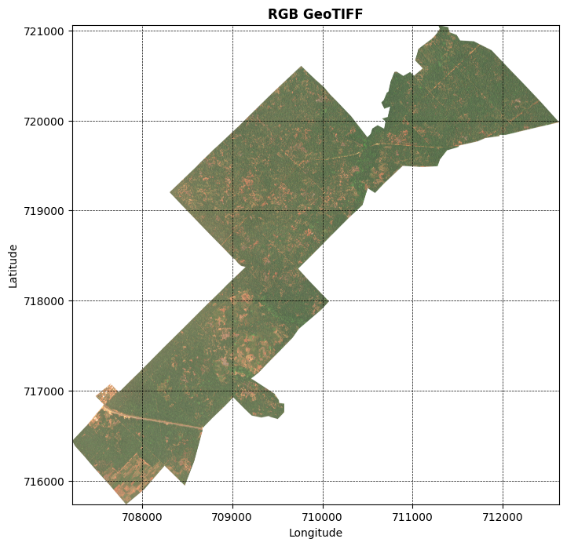
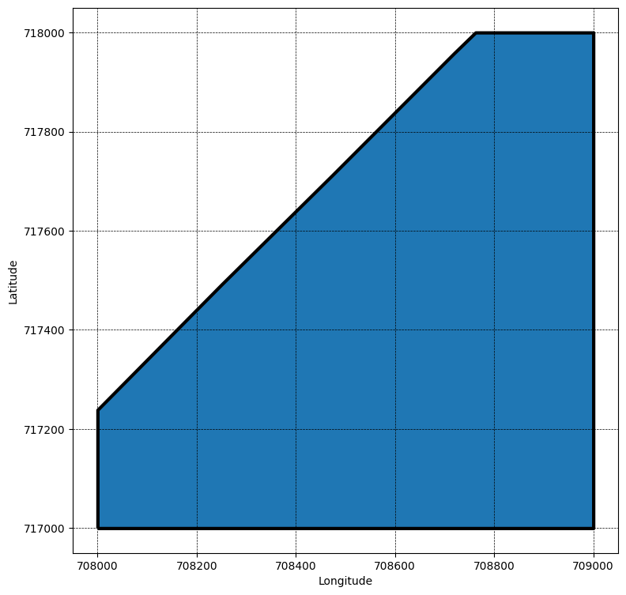
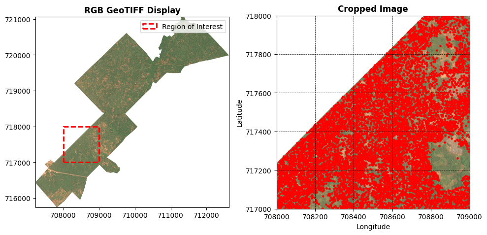

# Oil Palm Tree Detection and Counting

## Project Overview

This project aims to develop a machine learning model for detecting and counting oil palm trees in aerial or satellite imagery. The primary goal is to support agricultural monitoring and yield estimation by automating the identification of oil palm trees in large-scale geospatial data. By leveraging computer vision and geospatial analysis, the project seeks to provide accurate tree counts that can inform farming practices, resource allocation, and yield predictions.

The project utilizes high-resolution TIFF imagery and associated geospatial data (shapefiles) to train a Convolutional Neural Network (CNN) for binary classification of image patches containing oil palm trees versus non-trees.

## Goals

- **Agricultural Monitoring**: Enable real-time monitoring of oil palm plantations to track tree health, density, and distribution.
- **Yield Estimation**: Provide data-driven insights for estimating oil palm yields based on tree counts and spatial patterns.
- **Automation**: Reduce manual labor in tree counting by automating detection from imagery.
- **Scalability**: Develop a model that can be applied to large areas of land using satellite or drone imagery.

## Features

- Geospatial data processing using libraries like Rasterio and GeoPandas.
- Image patch extraction for positive (tree) and negative (non-tree) samples.
- CNN-based classification model built with TensorFlow/PyTorch.
- Visualization of detected trees on maps.
- Support for ROI (Region of Interest) cropping and boundary clipping.

## Requirements

- Python 3.8+
- Libraries: TensorFlow, Keras, Rasterio, GeoPandas, Shapely, NumPy, Pandas, Matplotlib, Scikit-learn
- Jupyter Notebook for running the development scripts

Install dependencies via pip:

```bash
pip install tensorflow rasterio geopandas shapely numpy pandas matplotlib scikit-learn
```

## Data

The project uses the following data sources located in the `training_data/` directory:

- **Imagery**: `image.tif` - High-resolution TIFF image of the oil palm plantation.
- **Trees Shapefile**: `trees/trees.shp` - Point data representing individual oil palm tree locations.
- **Boundary Shapefile**: `bounds/boundary.shp` - Polygon defining the plantation boundaries.
- **Annotations**: Text files with additional annotations (e.g., `annotations.txt`).

Data is processed to extract training patches:

- Positive samples: Patches centered on tree locations.
- Negative samples: Random patches without trees, ensuring no overlap with positive samples.


## Current State of the Work

The project is in active development, with work centered in `experiments/Oil-palm-CV.ipynb`. The current state includes:

- **Environment and Dependency Management**: A dedicated virtual environment has been created and dependencies are now tracked in `requirements.txt` (including TensorFlow, Rasterio, GeoPandas, OpenCV, and Ultralytics).
- **Data Preparation Pipeline**: TIFF imagery, tree points, and boundary shapefiles are loaded and transformed into a consistent geospatial workflow with ROI clipping.
- **Patch-Based Baseline (CNN)**: Positive and negative patches are generated and used to train a CNN binary classifier (tree patch vs non-tree patch), with baseline evaluation and prediction visualizations in place.
- **Object Detection Direction (YOLO)**: A new YOLO fine-tuning section has been added to the notebook to move from patch classification toward direct tree localization and counting.
- **Visualization Artifacts**: Key intermediate outputs are exported to the `results/` folder and documented below.

Overall, the project has a working baseline and a clear transition path to a stronger object-detection-based solution.

## Results (Notebook Visuals)

Key figures generated during the workflow in `experiments/Oil-palm-CV.ipynb` are saved in `results/` and shown below.

### Full Estate View



### ROI Boundary Overlay



### ROI Cropped Image



### Positive Training Patches


### Negative Training Patches


## Next Steps

To move this project toward robust tree counting and practical deployment:

1. **Stabilize Reproducible Setup**:
   - Add explicit virtual environment activation steps to the setup instructions.
   - Pin dependency versions in `requirements.txt` after confirming a stable run.
   - Validate notebook execution end-to-end in a clean environment.

2. **Complete YOLO Training Workflow**:
   - Run the new YOLO fine-tuning cells and persist training artifacts in `results/`.
   - Tune YOLO hyperparameters (`imgsz`, `epochs`, `batch`, confidence threshold).
   - Compare YOLO outputs against the CNN baseline using consistent validation data.

3. **Improve Label Quality and Dataset Coverage**:
   - Refine bounding box generation around trees for better detection supervision.
   - Expand training coverage to additional plantation regions and edge cases.
   - Add an explicit train/validation/test split strategy for geospatial generalization.

4. **Evaluation for Counting Accuracy**:
   - Track precision, recall, and mAP for detection quality.
   - Add counting-focused metrics (predicted vs actual trees per area/ROI).
   - Perform error analysis for missed detections and false positives.

5. **Production Readiness**:
   - Package inference into a reusable script/module (notebook-independent).
   - Add basic tests and lightweight CI checks.
   - Document model versioning and result reproducibility conventions.

## Contributing

Contributions are welcome! Please fork the repository and submit pull requests. For major changes, open an issue first to discuss proposed modifications.

## License

This project is licensed under the MIT License - see the LICENSE file for details.

## Contact

For questions or collaborations, please reach out to me at <james.o.oluwadare@gmail.com>.
